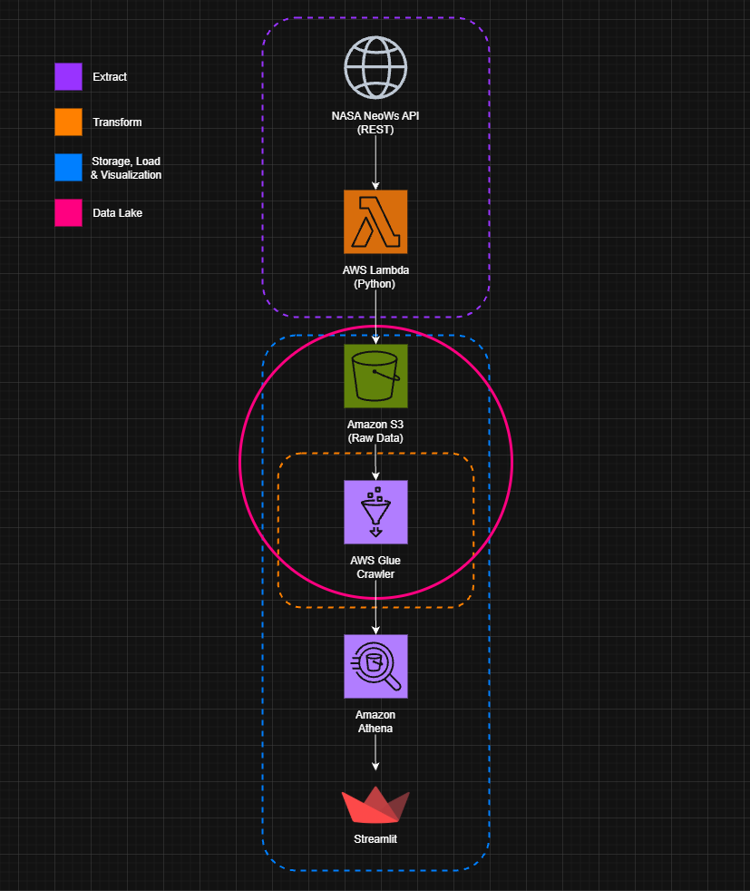

# ☄️ NASA Asteroid Dashboard

This repository contains a **serverless, real-time ETL data pipeline and interactive dashboard** that visualizes NASA's Near-Earth Object (NEO) approach data. It is powered by AWS and Streamlit.

---

**Key features:**

* 🌐 **Live NASA API Integration:** Automatically fetches daily asteroid data from [NASA NeoWs](https://api.nasa.gov/).
* 🗃️ **AWS Data Lake Architecture:** Serverless ingestion and storage of raw data to Amazon S3 in Athena-compatible `ndjson` format.
* 🔍 **Athena SQL Queries:** Analytical queries using Amazon Athena with AWS Glue for schema detection.
* 📊 **Interactive Dashboard:** View asteroid data by date, risk level, velocity, size and proximity through a [Streamlit Dashboard](https://streamlit.io/).
* 
---

## 🔧 Pipeline Overview

---

## 🛰️ Technologies Used

| Layer       | Tool/Service           | Details                                |
|-------------|------------------------|----------------------------------------|
| Ingestion   | `AWS Lambda`           | Python-based function triggered daily  |
| Storage     | `Amazon S3`            | NDJSON-based file storage              |
| ETL / Schema| `AWS Glue`             | Crawls & catalogs JSON for Athena      |
| Query Layer | `Amazon Athena`        | Serverless SQL analytics engine        |
| Scheduling  | `Amazon EventBridge`   | Daily automated trigger                |
| Viz/Frontend| `Streamlit Cloud`      | Visual UI for filtering asteroid data  |
